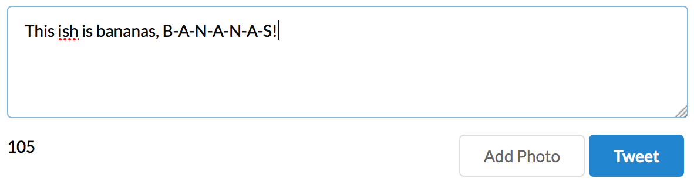

# SimpleReactApp
A simple React App that mimics the functionality of the Twitter UI. This small app was based on the tutorial by Shu Uesugi entitled "React.js Introduction For People Who Know Just Enough jQuery To Get By." You can see that tutorial <a href="http://reactfordesigners.com/labs/reactjs-introduction-for-people-who-know-just-enough-jquery-to-get-by/" target="_blank">here</a>. This version was developed using ES6, Webpack, Node, and <a href="http://semantic-ui.com/" target="_blank">Semantic UI.

